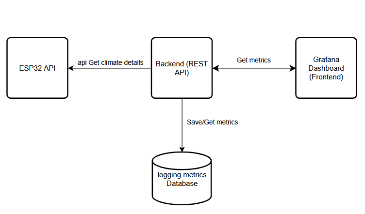
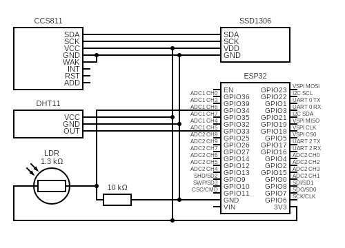

# Weather Watcher Software

## Description
This project aims at creating an application which logs climate details captured by ESP32 Microcomputers with sensors.

## Resources and Technologies

ESP32 Microcontrollers with climate sensors for measuring climate details:
- ESP frequency
- ESP temperature
- temperature
- humidity
- oxygen concentration
- light intensity
- eCO2 concentration

Architecture:

This project will work in a container structure (probably Docker or Kubernetes) There will be 3 containers running serverside which are:

1. Frontend Webserver (Dashboarding with React)
2. Backend Webserver (REST API with Spring)
3. Database (Postgres)

And one Micro Python Webserver on each ESP32.

 

